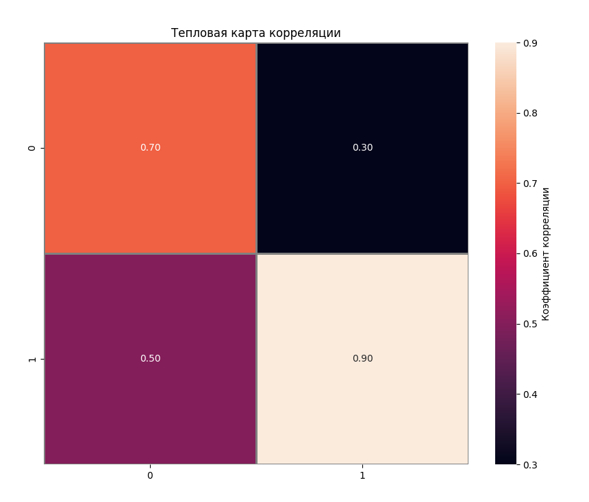
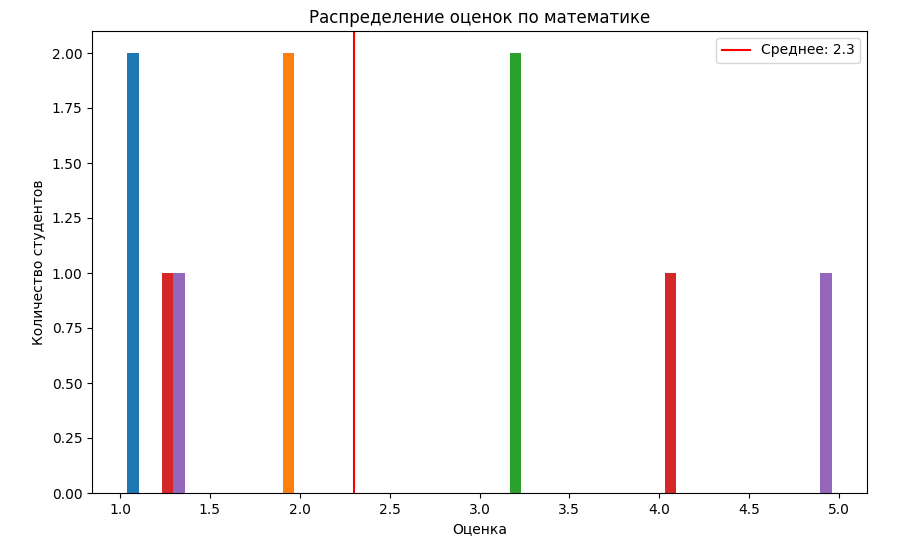
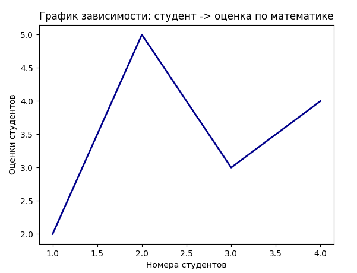
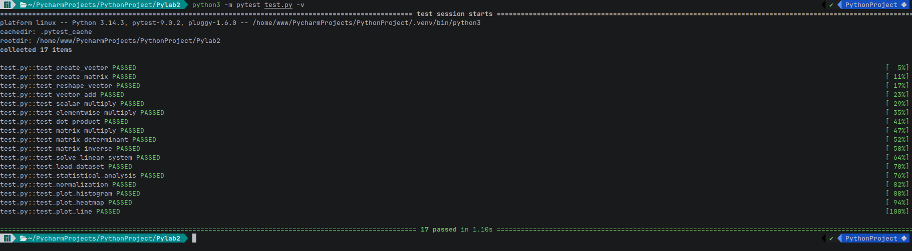

# Отчет по лабораторной работе №2
## Тема: Основы NumPy: массивы и векторные операции

**Ссылка на репозиторий:** [GitHub](https://github.com/fafakaj/Python_labs_II_sem/tree/main/Pylab2)

---

## 1. Цель работы
Изучение библиотеки `NumPy` для работы с многомерными массивами. Освоение векторизованных вычислений, операций линейной алгебры, загрузки данных через `pandas`, а также визуализации результатов с помощью `matplotlib` и `seaborn`.

---

## 2. Описание задачи
В рамках лабораторной работы необходимо было реализовать набор функций для:
1.  Создания и манипуляции массивами (векторы, матрицы).
2.  Выполнения арифметических операций без использования циклов (векторизация).
3.  Решения задач линейной алгебры (умножение матриц, определитель, обратная матрица, СЛАУ).
4.  Статистического анализа данных (загрузка из CSV, расчет метрик, нормализация).
5.  Визуализации данных (гистограммы, тепловые карты, линейные графики).

Корректность работы функций проверялась с помощью модульного тестирования (`pytest`).

---

## 3. Ход решения

### 3.1. Работа с массивами
Для создания массивов использовались функции `np.arange` и `np.random.rand`. Изменение формы массива осуществлялось методом `.reshape()`, а транспонирование — через `np.transpose()`.

```python
def create_vector():
    """Создать массив от 0 до 9."""
    return np.arange(10)

def create_matrix():
    """Создать матрицу 5x5 со случайными числами [0,1]."""
    return np.random.rand(5,5)

def reshape_vector(vec):
    """Преобразовать (10,) -> (2,5)"""
    return vec.reshape(2, 5)

def transpose_matrix(mat):
    """Транспонирование матрицы."""
    return np.transpose(mat)
```

### 3.2. Векторные операции
Все арифметические операции (сложение, умножение на скаляр, поэлементное умножение, скалярное произведение, перемножение матриц) реализованы средствами NumPy, что обеспечивает высокую производительность за счет отказа от явных циклов Python.

```python
def vector_add(a, b):
    """Сложение векторов одинаковой длины."""
    return a + b

def scalar_multiply(vec, scalar):
    """Умножение вектора на число."""
    return vec * scalar

def elementwise_multiply(a, b):
    """Поэлементное умножение."""
    return a * b
```

### 3.3. Линейная алгебра
Для операций над матрицами использовался подмодуль numpy.linalg. Реализованы функции: вычисления определителя, поиска обратной матрицы и решения систем линейных уравнений (Ax=b
Ax=b).

```python
def matrix_determinant(a):
    """Определитель матрицы."""
    return np.linalg.det(a)

def matrix_inverse(a):
    """Обратная матрица."""
    return np.linalg.inv(a)

def solve_linear_system(a, b):
    """Решить систему Ax = b"""
    return np.linalg.solve(a,b)
```

### 3.4. Анализ данных и визуализация
Данные загружались из CSV-файла с помощью pandas и конвертировались в `numpy.ndarray`. Были рассчитаны основные статистические метрики (среднее, медиана, перцентили). Реализована Min-Max нормализация.
Для визуализации использовались:
- `matplotlib.pyplot` — для гистограмм и линейных графиков.
- `seaborn` — для построения тепловой карты корреляции.

```python
def normalize_data(data):
    """Min-Max нормализация."""
    return (data - np.min(data)) / (np.max(data) - np.min(data))

def plot_heatmap(matrix):
    """Построить тепловую карту корреляции предметов."""
    plt.figure(figsize=(10,8))
    sns.heatmap(matrix, annot=True, fmt='.2f', linewidths=1, linecolor='gray', cbar_kws={'label': 'Коэффициент корреляции'})
    plt.title('Тепловая карта корреляции')

    plt.savefig('plots/correlation_heatmap.png')
    plt.close()

def plot_line(x, y):
    """Построить график зависимости: студент -> оценка по математике."""
    plt.plot(x, y, color='darkblue', linewidth=2)
    plt.title('График зависимости: студент -> оценка по математике')
    plt.xlabel('Номера студентов')
    plt.ylabel('Оценки студентов')

    plt.savefig('plots/student-marks.png')
    plt.close()
```

---

## 4. Нюансы реализации
В процессе выполнения работы были выявлены и учтены следующие важные аспекты:
1. Проверка размерностей: При умножении матриц и поэлементных операциях критически важно совпадение размеров. В функциях добавлены явные проверки shape, чтобы выбрасывать понятные исключения `(ValueError)` вместо ошибок времени выполнения от самой библиотеки.


2. Обработка вырожденных матриц: При вычислении обратной матрицы и решении СЛАУ необходимо проверять определитель. Если он близок к нулю `(np.isclose(det(), 0)`, матрица вырождена, и операция невозможна.

    
3. Нормализация данных: При Min-Max нормализации формула `(x−min)/(max−min)`, что может привести к делению на ноль, если все элементы массива одинаковы. Этот случай обрабатывается отдельной проверкой.

    
4. Типизация: В функции умножения на скаляр добавлена проверка типа множителя `(isinstance)`, чтобы избежать непредсказуемого поведения при передаче списков или других объектов.

    
5. Визуализация: Графики сохраняются в директорию `plots/`. Важно вызывать `plt.close()` после сохранения, чтобы освободить память и избежать наложения графиков при пакетном запуске тестов.

---

## 5. Результаты тестирования
Для проверки корректности кода был написан набор тестов в файле `test.py` с использованием фреймворка `pytest`.
Покрытые сценарии:
- Корректность форм массивов после создания и решейпа.
    
- Математическая точность операций (сравнение с эталонными значениями).
    
- Корректная обработка ошибок (неверные размеры матриц, нечисловые скаляры, вырожденные матрицы).
    
- Загрузка данных из временного CSV-файла.
    
- Генерация файлов изображений без ошибок.

#### Команда для запуска тестов:
```bash
python3 -m pytest test.py -v
```
Все тесты успешно пройдены, что подтверждает работоспособность реализации.

---

## 6. Вывод
В ходе лабораторной работы были закреплены навыки работы с библиотекой NumPy. Освоены инструменты линейной алгебры и базовые методы визуализации данных. Реализованный код является модульным, покрыт тестами и включает обработку граничных случаев.

---gi

## ФОТО Графиков и Тестов






